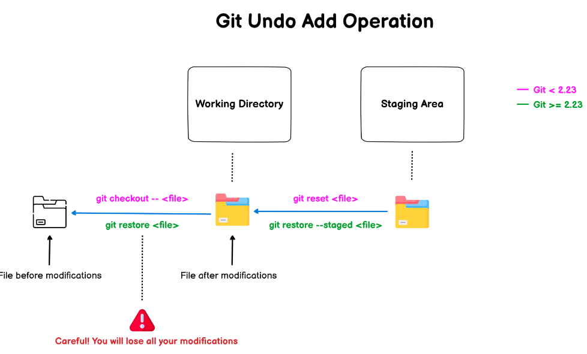

https://devconnected.com/how-to-undo-git-add-command/
1. after `git add .` if we want to unstaged changes then
```console
> git reset untrackedfile/untrack.pdf

Unstaged changes after reset:
M       addCommand/gitadd.md`

>  git restore --staged untrackedfile/untrack.pdf
```

2. Roll back to previous stage
```
> git checkout addCommand/gitadd.md
Updated 1 path from the index

❯ git restore addCommand/gitadd.md
```



